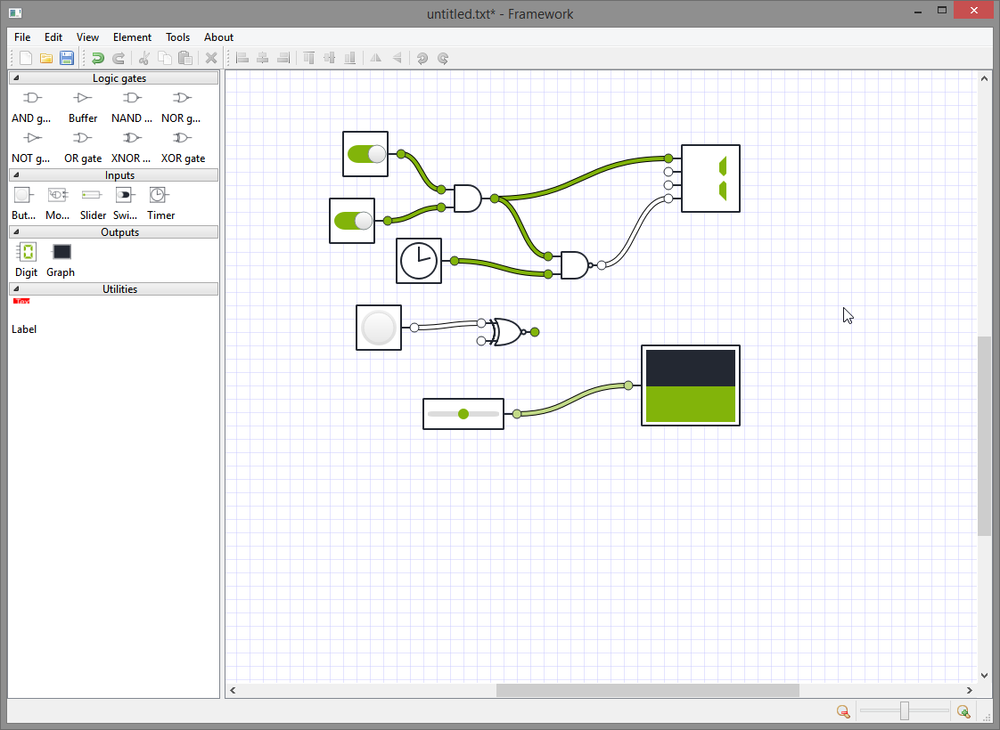

# Framework-logic-gates-circuit-simulator-WORKING
A software designed as a framework to test and experiment with different logic and electronic circuit i.e. logic gates, segment displays, etc. Easy plugin API for creating additional components. 

